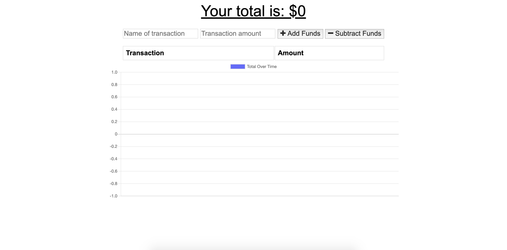

# budget-app

## Description

This program allows you to keep a personal budget. Allowing you to add income and expenses while showing a graph of your budget.

## Video of Program and/or Screenshot of Program


## Installing Packages

```
npm i || npm install
```

## How to run the Program Locally

```
npm run start || node app.js
```

## Link to Live

https://budget-app12.herokuapp.com/

## Langauges Used

* Node
* EspressJS
* MongoDB

## Contributing
Pull requests are welcome. For major changes, please open an issue first to discuss what you would like to change.
Please make sure to update tests as appropriate.

## License
No License required. These are public pages.